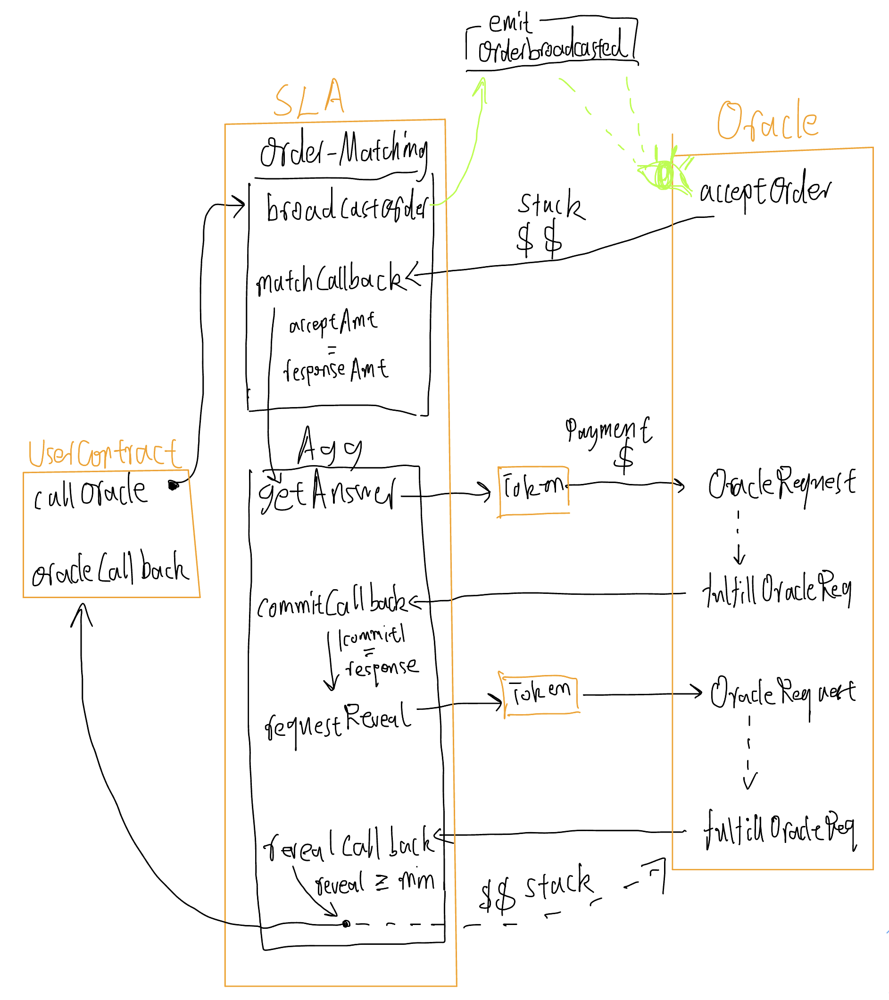

# Naive Oracle

Naive oracle is a student project which seeks to understand how oracles work. It does so by reimplementing the chainlink oracle v1 following the methodology of the [orginal white paper](./media/ChainlinkWPv1.pdf)

# Architecture

Architecture is....

## On-chain Contracts

Currently the architecture is an extremely simplified version of chainlink. The client contract
hooks into the Oracle Network by using the IServerLevelAggrement interface which contains the broadcastOrder method which
broadcast an order the oracle network for a request to completed

### Service Level Agreement (SLA)

When UserContract sends a request to SLA

- That means the user agrees to the rules we set up in our SLA**.**
- The SLA is designed as a TOOL that accepts customized requests.
- So SLA has minimum subjective operations, which means:
  - To maintain the scope of using this tool, the tool never blocks an oracle.

- i.e., for any oracle no meter hows their history (performance/reputation), there exist some customized requests allow this oracle to generate the answer for any user wants it to happen.
- Customization allows the user has complete control of defining the "accuracy" and balancing between accuracy and cost to meet their specific requirement.

When SLA communicates with an Oracle

- we are not limiting the on-chain part of the oracle (contract)
- we are not limiting the off-chain part of the oracle (node)
- therefore the oracle(on/off-chain) is allowed to be fully customizable
- as long as they compatible with our SLAgreement 

> Note: this possibly makes the difference from Chainlink

### Naive Tokens

NaiveTokens are intended to be the ERC20 tokens of our proof of concept network. User contracts will pay the tokens in exchange for access to the oracle network. Similarly oracle orperators would be require to stake coins in exchange for operating as an oracle node to incentivize good behaviour.

### Oracle

The Oracle represent the on chain component for oracle operators it is responsible for forwarding the answers to the SLA contract as will as being a contract which recieves and stakes NaiveTokens.

### User Contract

The user contract is an example contract on how user contracts in our network could be used.

## Frontend

To demonstrate the usecase we have a simple front end which calls a predefined user contract on chain which will call our oracle network for the price of eth/usd.
Due to time constraints this part of the frontend is extremely simplified and some basic functionality such as Tokens and Reputation is not implemented. 

## Oracle-Node

The oracle node clients is responsible for listening to on chain contract for orders broadcasted by the user contract. Once it hears a order broadcasted event
it will accept the order from the SLA retrieve the data needed and commit as part of a commit reveal scheme to the SLA contract. Once the SLA recieves every single
commit it will move on to the reveal phase where the retrieved value is revealed to SLA contract.  

## Setup/Contribution

1. In contract folder, run `npx hardhat run scripts/deploy.ts --network goerli`
2. Copy `TOKEN_ADDR`, `ORACLE_X`, `ORACLE_Y`, `ORACLE_Z`, `SLA`, `USER_CONTRACT` from terminal and add them to `oracle-node/.env`
3. Extract `oracle-node/abi/Oracle.json` and `oracle-node/abi/SLA.json` from
   - `contracts/artifacts/contracts/Oracle.sol/Oracle.json`
   - `contracts/artifacts/contracts/SLA.sol/SLA.json`
   - By only copy the abi list
4. In oracle-node folder, run `npm run start` to execute oracle contract `oracle-node/src/index.ts`
   - you could run up to 3 nodes by switching the `process.env.ORACLE_{X,Y,Z}`
5. In oracle-node folder, run `npm run test` to execute user contract  `oracle-node/test/test.ts`

## Next Steps

- basic offchain client
- data signing (optional)
- Service level agreements
  - oracle bidding -> order matching
  - real aggregations
    - performace -> Slashing Naive coins for bad behaviour
    - aggergation (mode)

- Frontend
- Video

## Possible Topics to Explore (if we have infinite time)

- verifiable random number
- chainlnk v2?

## Team Oracle Members:

- Soso Song (Zhifei Song)
- Nikhil Lakhwani
- Peter Chou
